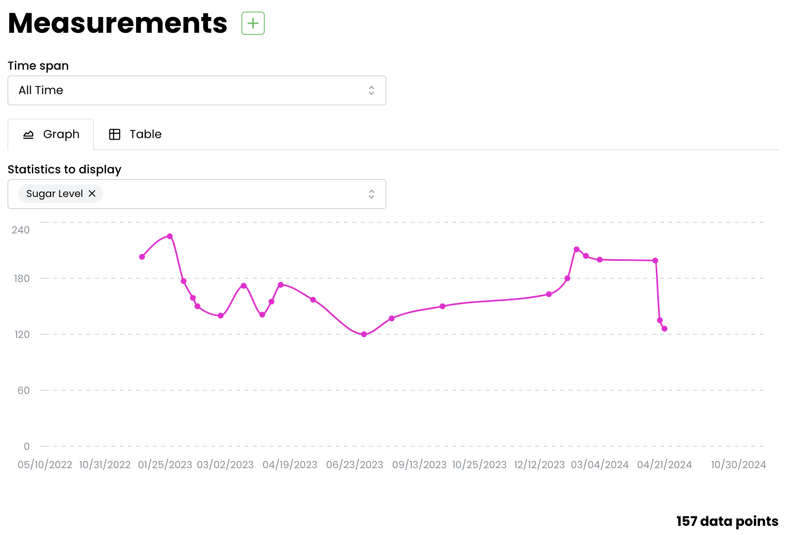
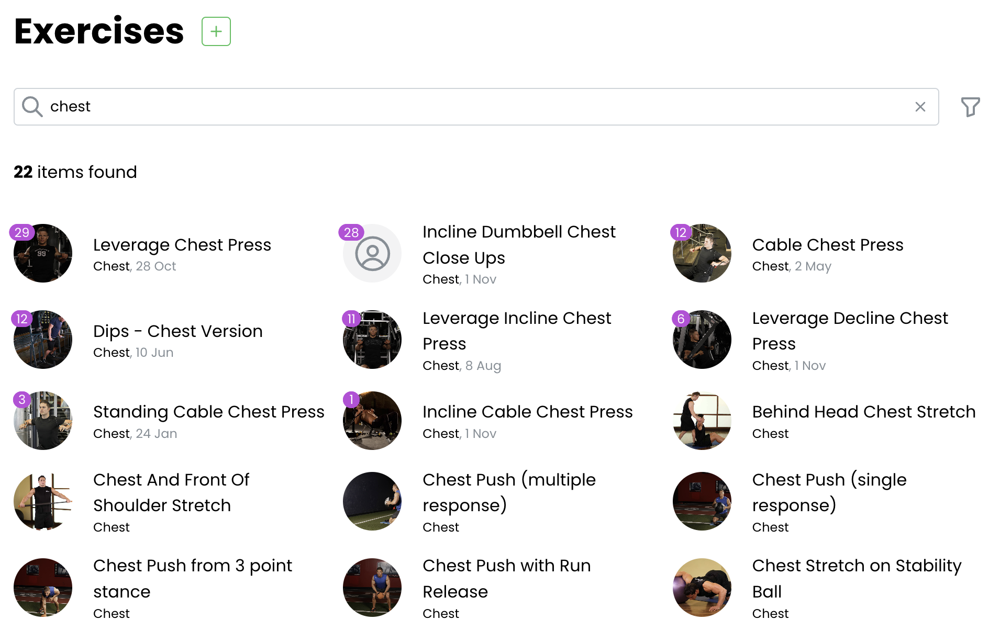

<h1 align="center">Ryot</h1>

<h3 align="center">
  A self-hosted, plugin-powered platform for tracking anything.
</h3>

  
  
  
  
  

    <a href="https://demo.ryot.io/demo" target="_blank">Live Demo</a> •
    <a href="https://docs.ryot.io" target="_blank">Documentation</a> •
    <a href="https://discord.gg/D9XTg2a7R8" target="_blank">Discord</a> •
    <a href="https://ryot.io/features" target="_blank">Pro Features</a>

  

## What is Ryot?

Ryot (**R**oll **Y**our **O**wn **T**racker), pronounced "riot", is a self-hosted
platform for building a tracker around your life. Plugins define what Ryot tracks
and how you interact with it. Ryot includes first-party plugins for media and
fitness, and new plugins can add entirely different kinds of tracking.

## Included Plugins

### Media

- Track movies, TV shows, anime, manga, books, comic books, audiobooks, podcasts,
  music, visual novels, and video games
- Import existing data from services such as Goodreads, Trakt, MyAnimeList, and
  Audiobookshelf
- Automate tracking through integrations with services such as Jellyfin, Plex,
  Kodi, and Emby
- Organize collections, discover recommendations, write reviews, and monitor
  upcoming releases

See the supported [imports](https://docs.ryot.io/importing/overview.html) and
[integrations](https://docs.ryot.io/integrations/overview.html).

### Fitness

- Log workouts with a database of more than 800 exercises
- Build workout routines with rest timers, supersets, and reusable templates
- Track exercise progress and body measurements over time
- Review progress through detailed history and graphs

  
  

## Demo

Try the [live demo](https://demo.ryot.io/demo). It uses a shared interactive
account, so changes to tracked data are visible to other visitors.

## Installation

Follow the [installation guide](https://docs.ryot.io/) to deploy Ryot. Container
images are available from [Docker Hub](https://hub.docker.com/r/ignisda/ryot) and
[GitHub Container Registry](https://ghcr.io/ignisda/ryot).

Upgrading from an earlier major release? Follow the
[migration guide](https://docs.ryot.io/migration.html).

## Technical Overview

- Self-hosted with full data ownership
- TypeScript on [Bun](https://bun.sh), with an [Effect](https://effect.website)
  backend and a [React](https://react.dev) client
- PostgreSQL for persistent data and Redis for background work
- A plugin-based core that can support new tracking domains
- Web, iOS, and Android clients, with mobile support through
  [Capacitor](https://capacitorjs.com)
- OAuth 2.1 authentication with optional external OpenID Connect login

## Pro Version

Ryot Pro adds profile sharing, personalized recommendations, enhanced collections,
and more. [Explore Pro features](https://ryot.io/features).

## Contributing

See the [contribution guide](CONTRIBUTING.md) to set up the project and validate
changes.

## Community

Questions or feedback? Join the [Discord server](https://discord.gg/D9XTg2a7R8)
or open a [GitHub issue](https://github.com/ignisda/ryot/issues).

## License

Ryot is source available under the [Elastic License 2.0](LICENSE). You may use,
modify, and redistribute it subject to the license's restrictions, including
the restrictions against offering Ryot as a hosted or managed service and
circumventing Pro license-key functionality.

Copyright 2023-2026 Diptesh Choudhuri and contributors. Diptesh Choudhuri is
the licensor.

## Acknowledgements

- Inspired by [MediaTracker](https://github.com/bonukai/MediaTracker)
- Exercise data from [Free Exercise DB](https://github.com/yuhonas/free-exercise-db)
- Thanks to all [contributors](https://github.com/IgnisDa/ryot/graphs/contributors)
