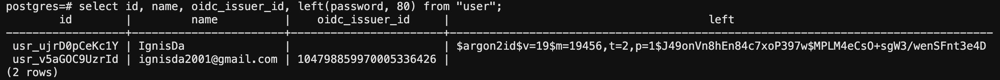
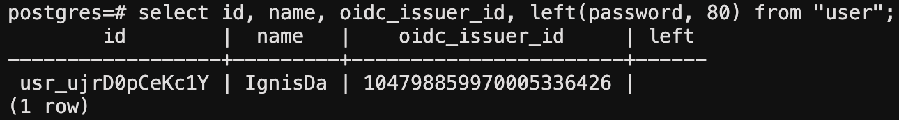

# Authentication

Ryot supports multiple authentication methods. By default, it uses local authentication
which means that you can log in using a username and password.

## OpenID

Ryot can be configured to use OpenID Connect (OIDC) for authentication. The following
environment variables need to be set:

```bash
FRONTEND_URL=https://app.ryot.io # The URL of your Ryot instance
SERVER_OIDC_CLIENT_ID=********
SERVER_OIDC_CLIENT_SECRET=********
SERVER_OIDC_ISSUER_URL=https://accounts.google.com # The URL of your OIDC provider (might end with trailing slash)
# Below are optional
FRONTEND_OIDC_BUTTON_LABEL=Use Google
RUST_LOG=ryot=debug # To debug why OIDC authentication is failing
```

In your OIDC provider, you will need to set the redirect URL to
`<FRONTEND_URL>/api/auth`. The scopes required are `openid email`.

Once these are set, restart your Ryot instance and you should be able to see the button to
"Continue with OpenID Connect" on the authentication pages. New users will have their
username set to their email address. This can be changed later in the profile settings.

You can set `USERS_DISABLE_LOCAL_AUTH=true` to disable local authentication and only allow
users to authenticate using OIDC. When OIDC is enabled and local authentication is
disabled, users will be redirected to the OIDC provider when they visit the auth page. To
see the authentication page anyway, you can visit
`<FRONTEND_URL>/auth?autoOidcLaunch=false`.

::: warning
A user can either have a username/password or it can use your OIDC provider to
authenticate but not both.
:::

### Converting a local user to an OIDC user

- Setup OpenID on your instance using the the above guide.
- Make a backup of your database using this
  [guide](../exporting.md#exporting-the-entire-database).
- Logout of your original account and then click on "Continue with OpenID Connect".
  Continue with user you want to select, after which a new account will be created.
- Let's say that I want `IgnisDa` below to be able to login using OIDC (of
  `ignisda2001@gmail.com`): 
- Drop into your database (`docker exec -u postgres -it ryot-db psql`) and copy the
  `oidc_issuer_id` (`104798859970005336426` here) of the new user and then delete it using
  `DELETE FROM "user" WHERE id = 'usr_v5aGOC9UzrId';`
- Update details of the old user using
  `UPDATE "user" SET oidc_issuer_id = '104798859970005336426', password = NULL WHERE id = 'usr_ujrD0pCeKc1Y';`.
  After this, it should look like this:
  

You should now be able login using OIDC. The same procedure needs to be followed for all users that want their provider changed to OIDC.
