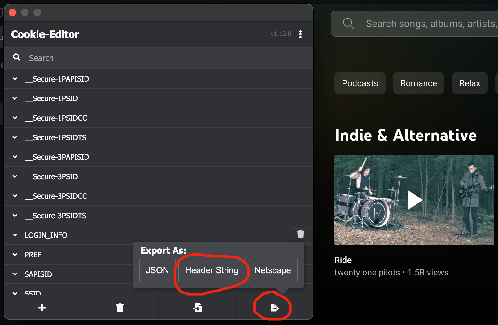

<script setup>
import variables from "./variables";
</script>

# Integrations

Integrations can be used to continuously update your media progress or inform external
services about changes. They can be of following types:

- _Sink_: An external client publishes progress updates to the Ryot server.
- _Yank_: Progress data is downloaded from an externally running server at a periodic
  interval.
- _Push_: Ryot sends data to an external service when an event occurs.

If an integration fails more than 5 times in a row, it will be automatically paused. This
behavior can be disabled from the integration's settings.

## Sink integrations

These work via webhooks wherein an external service can inform Ryot about a change. All
webhook URLs follow this format:

```txt
https://<instance_url>/backend/_i/<slug>
https://app.ryot.io/backend/_i/int_a6cGGXEq6KOI # example
```

::: warning
Keep your webhook urls private to prevent abuse.
:::

### Jellyfin Sink

Automatically add new [Jellyin](https://jellyfin.org/) movie and show plays to Ryot. It
will work for all the media that have a valid TMDb ID attached to their metadata.

::: info
Requires the
[unofficial webhook plugin](https://github.com/shemanaev/jellyfin-plugin-webhooks)
to be installed and active in Jellyfin.
:::

1. Generate a slug in the integration settings page. Copy the newly generated
   webhook Url.
2. In the Jellyfin webhook plugin settings, add a new webhook using the
   following settings:
    - Webhook Url => `<paste_url_copied>`
    - Payload format => `Default`
    - Listen to events only for => Choose your user
    - Events => `Play`, `Pause`, `Resume`, `Stop`, `Progress` and `MarkPlayed`

### Emby

Automatically add new [Emby](https://emby.media/) movie and show plays to Ryot. It
will work for all the media that have a valid TMDb ID attached to their metadata.

1. Generate a slug in the integration settings page. Copy the newly generated
   webhook Url.
2. In the Emby notification settings page, add a new notification using the
   Webhooks option:
    - Name => `ryot`
    - Url => `<paste_url_copied>`
    - Request Content Type => `application/json`
    - Events => `Play`, `Pause`, `Resume`, `Stop` and `Progress`
    - Limit user events to => Choose your user

::: warning
Since Emby does not send the expected TMDb ID for shows, progress will only be synced
if you already have the show in the Ryot database. To do this, simply add the show to
your watchlist.
:::

### Plex Sink

::: info
This will only import media that are in progress. Perform an
[import](./importing/plex.md) if you want to import media that are finished.
:::

Automatically add [Plex](https://www.plex.tv/) show and movie plays to Ryot. It will
work for all the media that have a valid TMDb ID attached to their metadata.

1. Generate a slug in the integration settings page using the following settings:
    - Username => Your Plex `Fullname`. If you have no `Fullname` specified in Plex,
       fallback to your Plex `Username`. This will be used to filter webhooks for the
       specified Plex account only.
2. In your Plex Webhooks settings, add a new webhook using the following settings:
    - Webhook Url => `<paste_url_copied>`

::: warning
Since Plex does not send the expected TMDb ID for shows, progress will only be synced
if you already have the show in the Ryot database. To do this, simply add the show to
your watchlist.
:::

### Kodi

The [Kodi](https://kodi.tv/) integration allows syncing the current movie or TV
show you are watching. It will work for all the media that have a valid
TMDb ID attached to their metadata.

1. Generate a slug in the integration settings page. Copy the newly generated
   webhook Url.
2. Download the addon from <a :href="`${variables.repoUrl}/releases`" target="_blank">github releases</a>.
   The file will have a name of `script.ryot.zip`.
3. [Install](https://kodi.wiki/view/Add-on_manager#How_to_install_from_a_ZIP_file)
   the zipped addon to your Kodi instance. Once installed, it will be visible under
   the "Services" sub category named "Ryot".
4. Click on "Configure" to fill in the correct details.

### Generic Json

The "Generic Json" can be used to import all possible data using a generic JSON data
format. The format of the JSON file should be `CompleteExport` as described in the
[exporting](guides/exporting.md#type-definitions) documentation.

You can use this to build integrations with other services that Ryot does not support
natively.

### Ryot Browser Extension  <Badge type="warning" text="PRO" />

The Ryot Browser Extension can automatically scrobble media that you are watching on
various streaming services.

::: tip
The extension works on most video streaming sites and will automatically extract media
information and sync your viewing progress to Ryot.
:::

1. Download the appropriate extension for your browser from <a
   :href="`${variables.repoUrl}/releases`" target="_blank">GitHub releases</a>:
   - **Chrome/Edge/Brave**: Download `ryotbrowser-extension-*-chrome.zip`
   - **Firefox**: Download `ryotbrowser-extension-*-firefox.zip`
2. Install the extension:
   - **Chrome/Edge/Brave**: Go to `chrome://extensions/`, enable "Developer mode", click
     "Load unpacked", and select the extracted folder
   - **Firefox**: Go to `about:debugging`, click "This Firefox", click "Load Temporary
     Add-on", and select the zip file
3. Generate a slug in the integration settings page and copy the newly generated webhook URL.
4. Configure the extension:
   - Click on the extension icon in your browser toolbar
   - Enter your webhook URL

## Yank integrations

You can configure the interval at which the data is fetched from the external source using
the `SCHEDULER_FREQUENT_CRON_JOBS_EVERY_MINUTES` environment variable. Defaults to `5`.

If you have enabled the `Sync to owned collection` option, the integration will also run
at night to add all media in your instance to your "Owned" collection.

### Audiobookshelf

::: info
This will only import media that are in progress. Perform an
[import](./importing/audiobookshelf.md) if you want to import media that are finished.
:::

The [Audiobookshelf](https://www.audiobookshelf.org) integration can sync all media if they
have a valid provider ID (Audible, ITunes or ISBN).

1. Obtain an API token as described in the Audiobookshelf
   [authentication](https://api.audiobookshelf.org/#authentication) docs.
2. Go to your Ryot integrations settings and add the correct details as described in the
   [yank](#yank-integrations) section.

### Komga

The [Komga](https://komga.org/) integration can sync all media if they have a valid
metadata provider. If you use [Komf](https://github.com/Snd-R/komf) or some similar
metadata provider these urls will be populated automatically. If you don't, you will either
need to manually add the manga to your collection or you can perform the following steps.

1. Navigate to the manga and open the Edit tab
2. Navigate to the Links tab
3. Create a link named `AniList` or `MyAnimeList` providing the respective url (not
   case-sensitive)
4. On Ryot, create an integration and select Komga as the source
5. Provide your Base URL. It should look something like this `https://komga.acme.com` or
   `http://127.0.0.1:25600`
6. Provide your Username and Password.
7. Provide your preferred metadata provider. Ryot will attempt the others if the preferred
   is unavailable and will fallback to title search otherwise.

### Plex Yank

This integration will add all media in your libraries to the "Owned" collection. If you
want to sync media progress, then take a look at the [Plex Sink](#plex-sink) integration.

1. Get the Plex token. If you want to import data for an admin account, then you need a
   [device
   token](https://www.plexopedia.com/plex-media-server/general/plex-token/#devicetoken).
   Otherwise, a current [user
   token](https://www.plexopedia.com/plex-media-server/general/plex-token/#getcurrentusertoken)
   is sufficient.
2. Go to your Ryot integration settings and fill in the details.

### Youtube Music <Badge type="warning" text="PRO" />

The [Youtube Music](https://music.youtube.com) integration syncs all music that you have
listened to ["Today"](https://music.youtube.com/history). Since Youtube Music does not have
an official API, this integration is prone to breakage and needs some roundabout steps to
setup.

1. Install the [Cookie Editor](https://cookie-editor.com) extension in your browser. Make
   sure you allow the extension to work on incognito windows.
2. Open a new incognito window in your browser and login to Youtube Music.
3. Once logged in, open the extension and export the cookies as "Header String". After
   copying them, close the incognito browser immediately so that they are not invalidated.
  
4. Paste the exported cookies in the input.

## Push integrations

You can enable the following push integrations:

### Radarr

Events: `Item added to collection`

1. Obtain your Radarr API key by going to the Radarr general settings page.
2. Fill the inputs in the integration settings page with the correct details.

### Sonarr

Events: `Item added to collection`

1. Obtain your Sonarr API key by going to the Sonarr general settings page.
2. Fill the inputs in the integration settings page with the correct details.

### Jellyfin Push <Badge type="warning" text="PRO" />

Events: `Item marked as completed`

1. While creating the integration, you will be asked to provide your Jellyfin username and
   password.
2. Every time you mark a movie or show as watched in Ryot, the integration will mark it as
   watched in Jellyfin.
