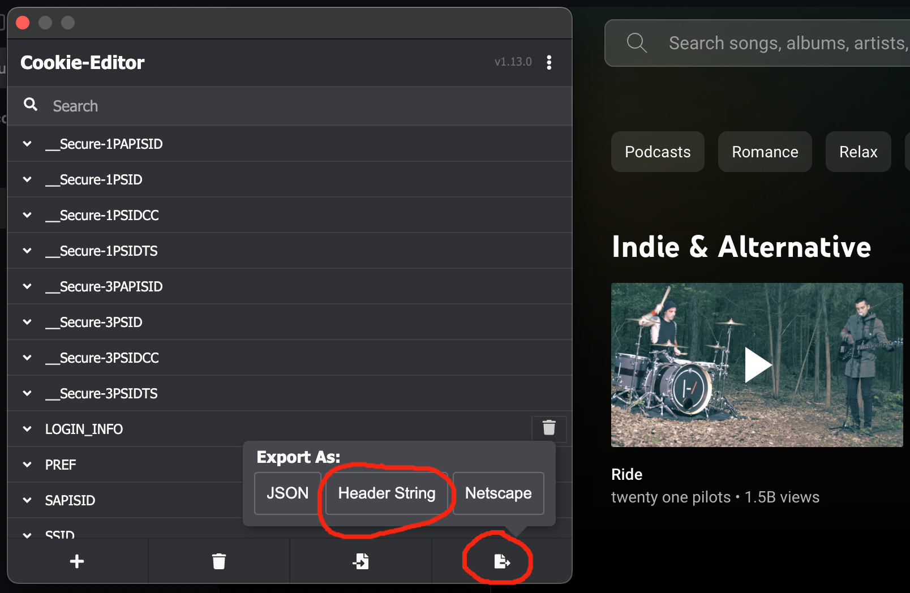

# YouTube Music <Badge type="warning" text="PRO" />

This integration reads the [Today history](https://music.youtube.com/history). YouTube Music has no
official API for this use, so the integration can break without notice.

YouTube Music does not provide playback times or repeated plays. Ryot records at most one play per
song each day. The first sync records 35% progress, the next five-minute sync completes it, and
later syncs ignore it. A song first found in the last ten minutes of the day completes immediately.

1. Install [Cookie Editor](https://cookie-editor.com) and allow it in private windows.
2. Open a private window and log in to YouTube Music.
3. Export the cookies as **Header String**, then close the private window immediately so the
   cookies remain valid.
   
4. Under **Settings > Integrations**, create a YouTube Music integration and paste the cookies.

::: warning
Cookies can grant access to your account. Store them as secrets and do not share them.
:::
