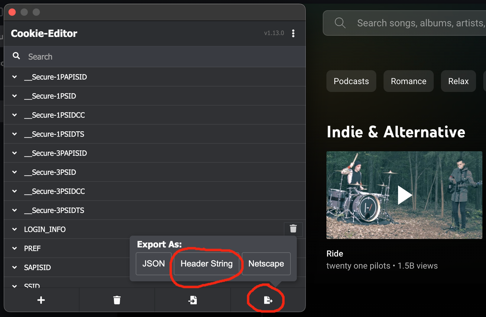

# Youtube Music <Badge type="warning" text="PRO" />

The [Youtube Music](https://music.youtube.com) integration syncs all music that you have
listened to ["Today"](https://music.youtube.com/history). Since Youtube Music does not have
an official API, this integration is prone to breakage and needs some roundabout steps to
setup.

1. Install the [Cookie Editor](https://cookie-editor.com) extension in your browser. Make
   sure you allow the extension to work on incognito windows.
2. Open a new incognito window in your browser and login to Youtube Music.
3. Once logged in, open the extension and export the cookies as "Header String". After
   copying them, close the incognito browser immediately so that they are not invalidated.
  
4. Paste the exported cookies in the input.
