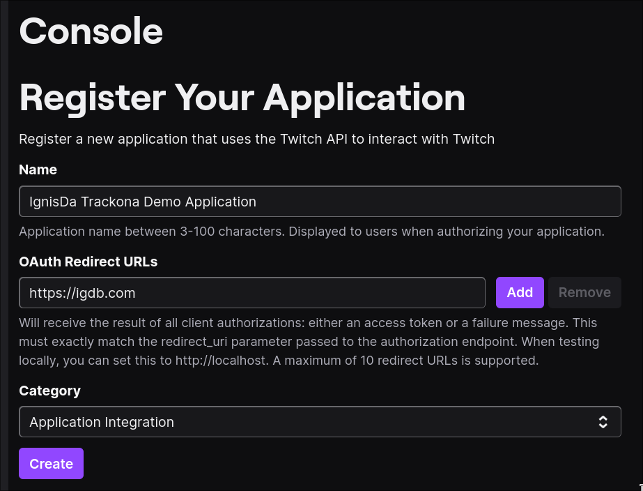

# Integration with IGDB

Trackona supports tracking video games via [IGDB](https://www.igdb.com/). However,
the API is heavily rate limited, so it is not possible to hardcode the API keys
in the application (unlike other keys which are [hardcoded](../apps/backend/src/config.rs)).

You can follow the below steps to obtain your own API keys to enable video game
tracking.

## Steps

1. Create a [Twitch](https://twitch.tv) account.

2. Open your [developer console](https://dev.twitch.tv/console).

3. Click on "Register Your Application" on the dashboard.

3. Fill up the details.

	

	Note that you must use a unique name. Any name will suffice.	Click on
	"Create" when you are done.

4. You will be guided back to your application dashboard. Click on "Manage" for
	the application you just created.

5. Generate a client secret. Copy the **Client ID** and **Client Secret**.

6. Set the `VIDEO_GAMES_TWITCH_CLIENT_ID` and `VIDEO_GAMES_TWITCH_CLIENT_SECRET`
	environment variables in the system in which the Trackona server is running.
	
## Conclusion

After following these steps, you should have video game integration working
properly!
